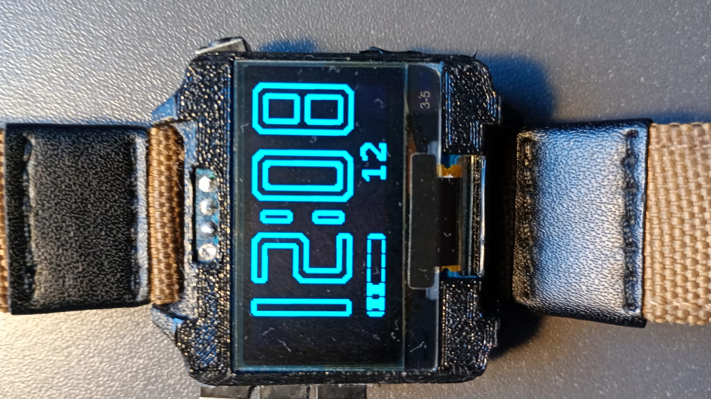

# ESP32 based watch firmware for SH1106 OLED



This is a simple firmware meant for **wrist watches** that provides regular digital watch functionality with ability to easly add sensors, feedback devices, and other functionality.

## Hardware
This is a list of hardware the code was tested on:
1. **MCU board:**\
    xiao esp32c6/esp32c3 super mini
2. **Display:**\
    monochrome 128x64 oled display
3. **RTC:**\
    DS3231
4. **Buttons:**
    - 3 tact switches connected to gpio specified in `buttonPins` in `main.cpp`.
    - 1-2 tact switches connected to gpio that is capable of waking the chip up from deepsleep (Depending on the board it can be labeled as RTC Pin or LP Pin or other) specified in `wakePins` in `main.cpp`.
5. **Battery:**\
    Any cell that supports li-po/li-ion charging. Not necessary, see user's guide if not used.
6. **Battery voltage divider:**
    - connections:
        ```
        GND -- R1 -- ADC -- R2 -- BAT+
        |______C1_____|
        ```

        ***R1/(R1+R2) = `batteryVoltDivFac`***\
        **C1 = 100nF**\
        The capacitor is only needed when using high resistance resistors (add it when the circuit does not work properly).

        `batteryVoltDivFac` deafult value is 2.0.

        ADC is an analog pin specified by `batteryAdcPin` in `main.cpp`.\

***
***
## User's guide
This simple guide will walk you through setting up the code to work with your hardware.
___
### Editing switches pinout
To edit pins your switches are connected to, head to `main.cpp` and change the values in `buttonPins` array. The order matters for buttons' functions.

To edit pins that can wake up your esp, once again head to `main.cpp` and change the values in `wakePins` array. Here, the order doesn't matter, just make sure to use the pins that are cappable of waking up the MCU from deepsleep on hardware level. You can duplicate pins that are already specified in `buttonPins` here.
___
### Allowing for Wi-Fi connection
To configure your device to connect to your network (home wifi, hotspot, or anything), you have to make a new file in `src/` directory called `config.h`. Paste there this code:
```c++
#ifndef CONFIG_H
#define CONFIG_H

#include "WiFiTime.h"

namespace Config {
    WiFiEntry WiFiNetworks[] = {{"Network1_ssid", "Network1_pass"},
                                "Network1_ssid", "Network2_pass"};
};

#endif
```
Change the dummy ssid and password values for the real ones the code is going to try to connect in order to synchronizes time from UDP server.
___
### Adjusting battery voltage divider adc
To change the pin your battery voltage divider is connected to, change the `batteryAdcPin` variable in `main.cpp`.

To change the voltage divider factor (see hardware, pt. 6 for formula) change the `batteryVoltDivFac` value in `main.cpp`.

**Note:** If you're not using a battery, comment the `#define USE_BATTERY` line in `mainHeader.h`. This should be done to prevent the code from going into *critical battery* mode and making your device unusable.
___
### Disabling external rtc
If you don't want to use an external rtc module and the internal timer precision is good enough for your purpouse, you can disable external rtc by commenting the `#define USE_EXT_RTC` line in `mainHeader.h` file. This will make the esp use its internal rtc.
***
***
## Navigation and functionality
The firmware's functionality is separated in form of screens, each of which provides different operation settings, navigation etc. In this point I will break down everything about every screen provided in the firmware.

1. **Time screen**\
    Deafult screen showing current time and battery level.
    - delay until deepsleep: **10s**, **6s** if woke up and not further used
    - navigation (buttons):
        - 1: cycle to the **next screen**
        - 2: jump to **screen with id 2** (date screen by deafult)
        - 3: jump to **screen with id 3** (timer screen by deafult)

2. **Stopwatch screen**\
    Just a stopwatch.
    - delay until deepsleep: **180s** if not running, **never** if running
    - navigation while not running (buttons):
        - 0: return to **clock screen**
        - 1: cycle to the **next screen**
        - 2: **resets** the stopwatch
        - 3: **starts** the stopwatch
    - navigation while running (buttons):
        - 2: register **lap time**, press again to release
        - 3: **pause stopwatch**

3. **Date screen**\
    Simple screen showing current date and battery voltage
    - delay until deepsleep: **10s**
    - navigation (buttons):
        - 0: return to **clock screen**
        - 1: cycle to the **next screen**

4. **Timer screen**\
    Simple timer counting down.
    - delay until deepsleep: **180s** if not running, **never** if running
    - navigation while not running (buttons):
        - 0: cycle to the **next screen**
        - 1: cycle to the **next setting option**
        - 2: **decrease** current setting option
        - 3: **increase** current setting option
    - navigation while running (buttons):
        - 0: **turn on/off** display
        - 2: **stop & reset** the timer
        - 3: **stop** the timer

5. **WiFiTime screen**\
    Screen used to synchronize time through wifi. To use press `button 3`. The device is going to go **deepsleep**. When you wake it up, it will try to **synchronize the time**. Once it's done, press `button 0` to return to clock screen.
    - delay until deepsleep: **45s**
***
***
## Other information
This firmware is meant for small (wearable?) devices **running on battery**, so the esp will go into **deepsleep mode** after a set time (usually about 10s) while also **clearing oled display** to save power.\
*SDA* and *SCL* pins for *I2C* are **not specified** anywhere in the code, so you should use the ones marked on your **board's pinout**.

***
***
## Build tips
### Arduino IDE uploading
This is the deafult build and upload option, and all the code is set to work with it by deafult. To use it open the `src/` folder in arduino IDE. Here is the list of needed libraries for this project:
- **Adafruit GFX Library@^1.12.4** from **adafruit**
- **Adafruit SH110X@^2.1.14** from **adafruit**
- **DS3231@^1.1.2** from **nothernwidget**
- **SparkFun MAX3010x Pulse and Prox@^1.1.2** from **sparkfun**
- **Time@^1.6.1** from **paulstoffregen**\
To install any missing libraries from this list, in Arduino IDE go to libraries manager and install appropriate versions of missing libraries. 
---
**Note:** the `src.ini` file is **crucial** for this process, as it acts like a wrapper for `main.cpp` to work with Arduino IDE.
___
### PlatformIO uploading
If you have a board that **PlatformIO** supports, you can try this uploading option as it is **significantly faster**. There is a working `platformio.ini` file included in the repo configured for **esp32 c3** (tested on esp32 c3 super mini). You also have to edit the code a little bit:
1. Uncomment `// include <Arduino.h>` in `main.cpp`
2. Rename `appSetup` and `appLoop` functions to `setup` and `loop` correspondingly
3. It is recommended to delete `src.ini` from `src/` directory to avoid compiling issues (although I didn't exprienced those with this file present)
